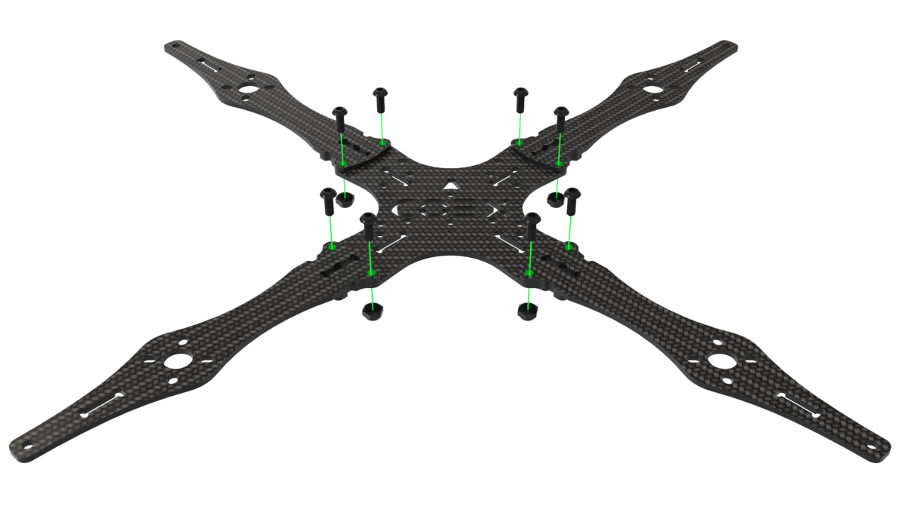
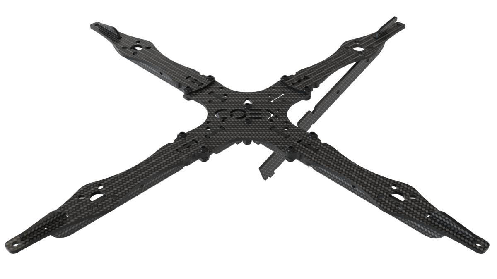
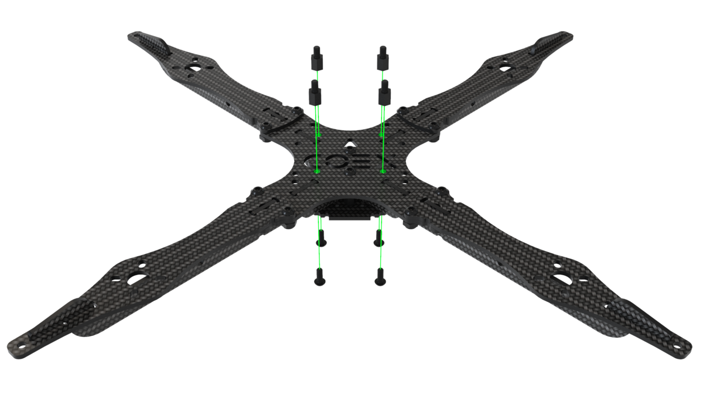
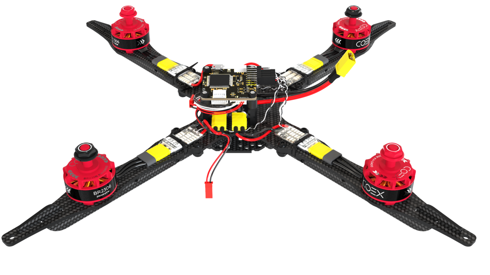

# Clover 4 assembly

## Fasteners size

> **Hint** During assembly, screws and racks of various sizes are used, using fasteners of the wrong size can damage the copter.

<table class="type_table">
    <tr>
        <td></td>
        <td>Screw M3x10</td>
        <td></td>
        <td>Aluminium rack 40mm</td>
    </tr>
    <tr>
        <td></td>
        <td>Screw M3x8</td>
        <td></td>
        <td>Aluminium rack 15mm</td>
    </tr>
    <tr>
        <td></td>
        <td>Screw M3x5</td>
        <td></td>
        <td>Nylon rack 40mm</td>
    </tr>
    <tr>
        <td></td>
        <td>Screw M2x5</td>
        <td></td>
        <td>Nylon rack 30mm</td>
    </tr>
    <tr>
        <td></td>
        <td> Nut M3 (self-locking)</td>
        <td></td>
        <td>Nylon rack 20mm</td>
    </tr>
    <tr>
        <td></td>
        <td> Nut M3 (nylon)</td>
        <td></td>
        <td>Nylon rack 15mm</td>
    </tr>
    <tr>
        <td></td>
        <td>Damper rack</td>
        <td></td>
        <td> Nylon rack 6mm</td>
    </tr>
</table>

## Frame Assembly

1. Align the 4 beams with the center deck, fix them with the M3x8 screws and nuts with a nylon insert.

    

        
        
    

2. Install 2 15mm posts on the center holes in the main deck and fix them with the M3x8 screws.

    

3. Install the stiffener hook into the groove in the beam.

    

4. Press the stiffeners onto the main deck.

    

5. Tighten the stiffeners with a small carbon deck.

    

6. Install 4 6mm nylon posts and fix them with the M3x5 screws.

    

## Installating motors

1. When installing motors, pay attention to the rotation scheme of the motors. The rotation marking on the motors must match the rotation pattern.

    

2. Mount the motor on the corresponding holes in the beam using **M3x5 screws**.

> **Caution** Make sure that the motors are secured with M3x5 screws, otherwise a short circuit between the windings may occur.

## Installing ESC and PDB

1. Install the Power Distribution Board (PDB) on the pre-mounted stands, it must be installed with the power cable pointing towards the rear of the aircraft.

2. Install the speed controllers (ESC) in the appropriate positions on the beam and tighten with cable ties.

3. Measure out the required amount of ESC power wire, and cut off the excess.

4. Strip and tin the cut wires

5. Tin the contact pads on the power distribution board.

6. Solder the ESC power wires to the power distribution board.

     > **Caution** Be careful with the pin signatures on the board. The red wire should go to the site with the signature *+*, and the black one to the signature *-*.

7. Cut off the excess phase cable coming from the motors.

8. Strip and tin the phase cables.

9. Tin the contact pads of the governors.

10. Solder the phase cables to the contact pads of the regulators in any order.

## Installing the flight controller

The *Clover 4* set allows you to install various flight controllers, for example *COEX Pix* and *Pixracer*.

> **Caution** When installing the flight controller, pay attention to the arrow located on the board, when installing it should be directed towards the nose of the aircraft.

### COEX Pix

> **Hint** Before installing the damper struts, screw in 2 layers of nylon nuts for a stronger hold or bite off excess threads with side cutters.

1. Secure the power distribution board with nylon nuts and mount the damper posts on top.

2. Install the flight controller and secure with nylon nuts.

3. Insert the flash card for logging into the flight controller.

### Pixracer

1. Secure the power distribution board with 6mm nylon struts.

2. Install the small mounting deck and secure with nylon nuts.

3. Glue 3-4 layers of double-sided tape, glue it in the center of the small deck and place the *Pixracer* on top.

## Connecting a flight controller

1. Connect the ESCs to the flight controller according to the diagram.

    

2. Connect the power cable to the power distribution board (PDB) and the corresponding connector on the flight controller.

    

3. Install the 40mm aluminum posts onto the M3x12 screws.

    

        
        
    

## Installing Raspberry Pi

1. On the main deck, install the 20mm stands, fix them with the M3x8 screws.

2. Install 6mm posts and 30mm posts on the mounting deck, fix them using the M3x5 and M3x12 screws respectively.

3. Place the assembled mounting deck on the main deck and secure with M3x8 screws.

4. Install *Raspberry Pi* board and secure with nylon nuts.

5. Install the rangefinder on the gripper deck using self-locking nuts and M3x8 screws, and glue the radio receiver using double-sided tape.

6. Install 4 posts 20mm and fix them with M3x8 screws.

7. Place the camera on the small mounting deck and fix it with 2 self-tapping screws М2х5 in the upper left and lower right corners.

8. Place the camera module onto the gripper deck and secure with M3x8 screws.

9. Install the assembled grapple deck and secure with the M3x8 screws.

10. Connect the rangefinder and power cable to *Raspberri Pi*.

11. Connect the radio to the flight controller using the *RCIN* connector.

12. Connect the camera cable to *Raspberry Pi*.

13. Connect the flight controller to *Raspberry Pi* using the USB cable.

## Installing LED strip and legs

1. Assemble the hoop for the LED strip by locking the ends together.

2. Stick the LED strip on the hoop, for more strength, tighten it with 3-4 clamps.

3. Install the legs on the stiffener plate using self-locking nuts and M3x8 screws using only the outermost mounting holes. From below, between the plates of the legs, install a damper silicone ring.

4. Bend the legs back and install the hoop with the LED strip in the special groove on them, so that the connection cables come out from the tail side of the copter.

5. Secure the legs with self-locking nuts and M3x8 screws.

6. Connect the LED strip power (red, black cables) to the JST connector on the power distribution board.

7. Connect the signal output of the LED strip (white cable) in *Raspberry Ri*, to pin *GPIO 21*.

## Setting protection

1. Assemble the lower level of protection using 40mm posts and M3x12 screws.

2. Assemble the upper layer of protection using the M3x12 screws.

3. Place the mounting deck and secure it with M3x8 screws.

4. Install the guard and fix it to the beams with self-locking nuts and M3x8 screws.

> **Success** The drone is assembled, then perform ["setup"](setup.md).