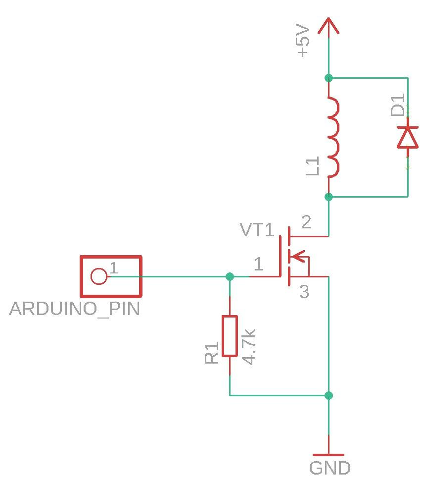
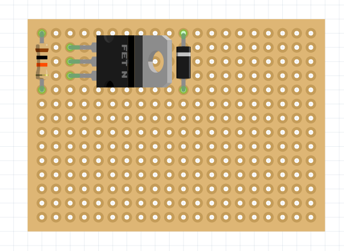
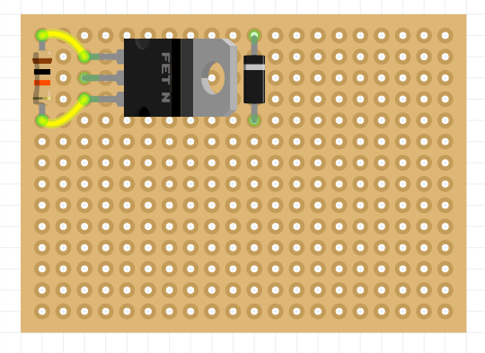
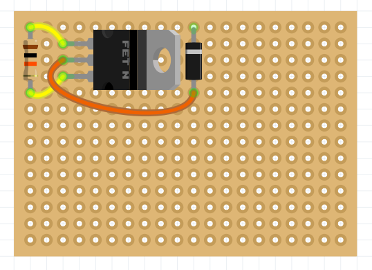
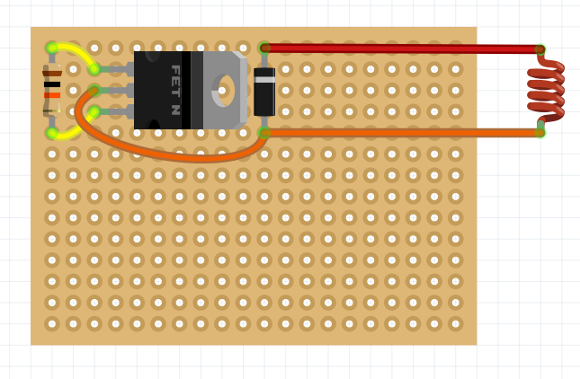
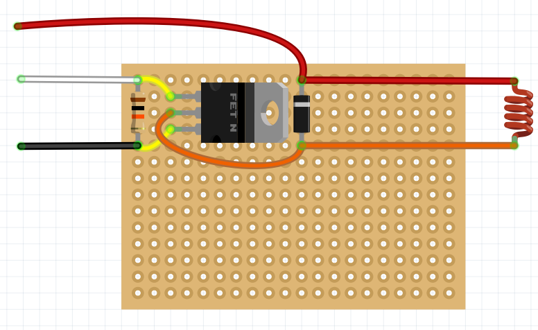
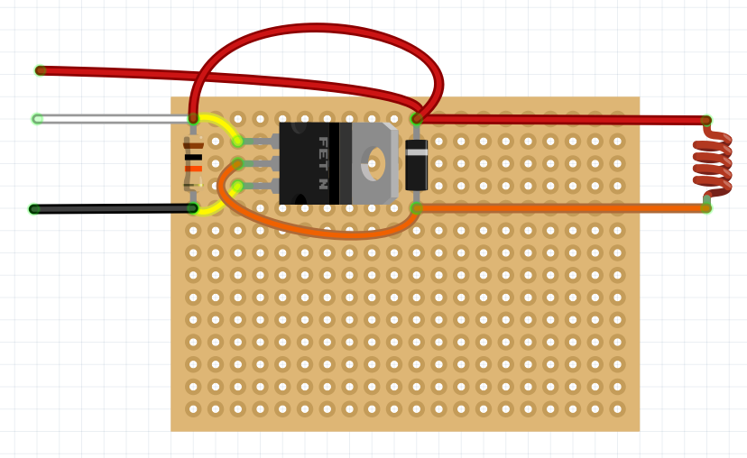
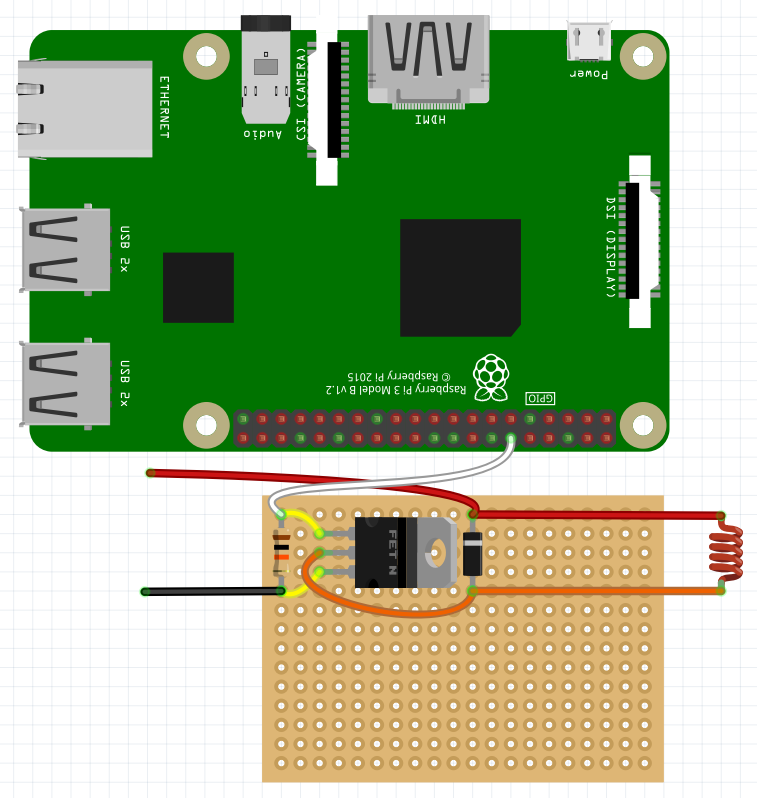
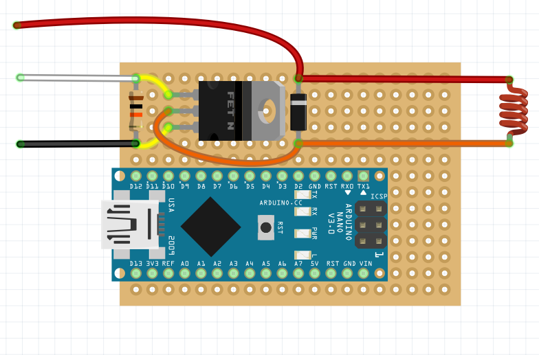

# Assembling and configuring the electromagnetic gripper

The magnetic gripper can be assembled in various ways according to the electrical connections.

Below is an example of assembling an electromagnetic capture circuit on a breadboard.

> **Info** It is recommended to do the wiring between the elements on the back side of the board (in the following images, the wiring is done over the circuit, for greater clarity).

1. Place *Schottky diode*, *10kOhm resistor* and *transistor* on the soldering board.

    

2. Solder the contacts on the other side of the board and bite off the remaining legs of the elements.

3. Connect the contacts of the resistor and the two outer legs of the transistor.

    

4. Connect the center leg of the transistor and the leg of the Schottke diode (opposite the gray marker strip).

    

5. Cut the required amount of magnetic grib wire and solder it to the contacts of the Schottke diode.

    

6. Solder the *Dupont* male wires to the transistor and diode leg (red, black wires), and the *Dupont* female wires to the opposite transistor leg (white wire).

    

## Checking the operation of the electromagnetic gripper

In order to check the operation of the gripper, apply a voltage of 5V to the signal wire. You can use the *Dupont* dad-dad wire for this.

After applying voltage, the magnet should turn on.

## Connecting to Raspberry Pi

It can be connected to *Raspberry Pi* to program activate the magnetic gripper.

An example of the code that activates the magnetic gripper can be viewed [here](gpio.md#connection-electromagnet).

## Connecting to Arduino

It can be connected to the *Arduino Nano* board for manual control of the grip.

It is convenient to place it on the same soldering board. To do this, insert it into the appropriate holes and solder it from the back to the breadboard.

Then connect the signal output of the circuit to the selected port and solder the *Dupont* female wire to the selected signal port.

## Installing electromagnetic gripper

1. Install an electromagnet into the center hole on the gripper deck.

2. Use a zip tie to pull the assembled circuit to the back of the deck.

3. Plug the *Arduino D11* signal pin into one of the *AUX* pins on the flight controller.

4. Set the power terminal of the electromagnetic gripper to *JST* 5V.
